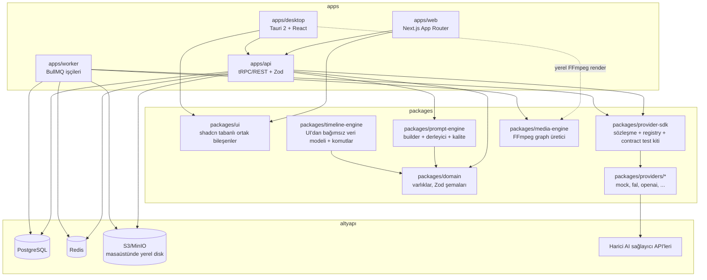
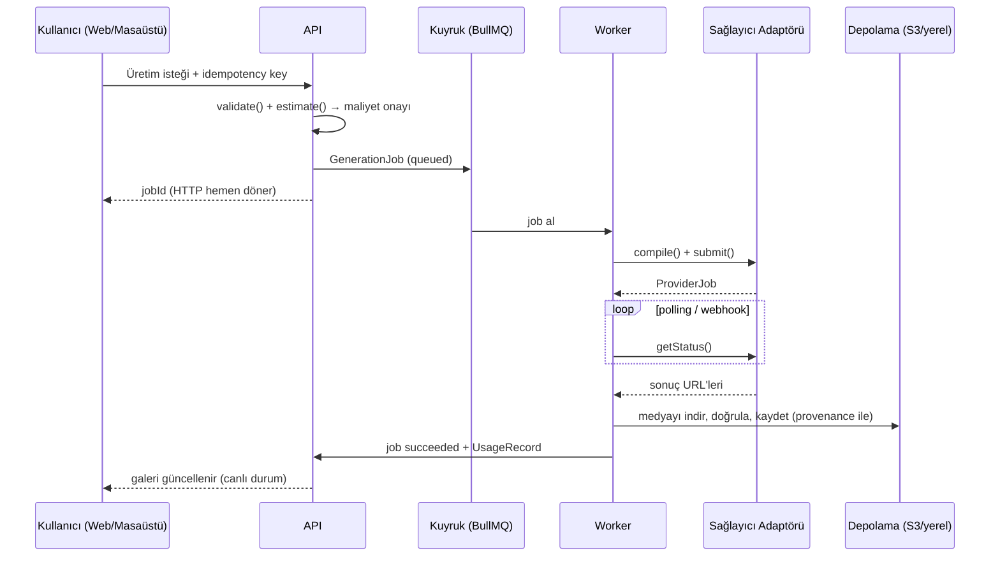

# Faz 0 — Keşif ve Tasarım: Yapay Zekâ Video Üretim ve Kurgu Stüdyosu

> Bu belge yalnızca planlamadır; henüz uygulama kodu yazılmamıştır. Faz 1'e geçiş kullanıcı onayına bağlıdır.

## 1. İsteğin Yeniden Tanımı

Türkçe öncelikli, çok dilli, web (Next.js) ve Windows masaüstü (Tauri 2) üzerinde çalışan, uçtan uca bir **AI video üretim ve kurgu stüdyosu** geliştirilecek. Sistem; fikir → senaryo → sahne/shot → storyboard → yapılandırılmış prompt → çoklu sağlayıcı üzerinden üretim → varlık kütüphanesi → çok kanallı timeline kurgusu → ses/altyazı → FFmpeg ile dışa aktarma zincirinin tamamını yönetir. Çekirdek mimari sağlayıcı-bağımsızdır: tüm AI entegrasyonları capability manifestli bir Provider SDK üzerinden adaptör olarak takılır. Maliyet tahmini, idempotency, güvenlik (KVKK/GDPR, deepfake/izin politikaları) ve test kapıları tasarımın parçasıdır. Geliştirme 9 faza bölünmüştür; her faz sonunda doğrulama ve kullanıcı onayı vardır.

## 2. Mevcut Repository Durumu

`/home/user/CLAUDE` deposu incelendi (dal: `claude/new-session-do4mhh`):

| Bulgu | Detay |
|---|---|
| Mevcut proje | **LifeTrack**: bağımsız HTML uygulaması (`lifetrack-app.html`, şifreli sürüm), Expo/React Native mobil uygulama (`lifetrack-mobile/`), derlenmiş APK (~62 MB), Vite tabanlı `lifetrack/` klasörü (node_modules commit'li) |
| İlgililik | Video stüdyosuyla **ilgisiz**; hiçbir dosyasına dokunulmayacak |
| Monorepo altyapısı | Yok — kök dizinde `package.json`, `pnpm-workspace.yaml`, CI yapılandırması bulunmuyor |
| `AGENTS.md` / `CLAUDE.md` | Yok |
| Öneri | Yeni proje, mevcut işlerden tamamen izole biçimde `video-studio/` alt dizininde kendi monorepo'su olarak kurulmalı (bkz. Soru 1) |

## 3. prompts.chat'ten Alınan ve Alınmayan Fikirler

`f/prompts.chat` (MIT lisanslı kod; prompt içerikleri CC0) incelendi. Kod kopyalanmayacak; yalnızca mimari yaklaşım referans alınacak ve `docs/adr/` altında attribution belgelenecek.

**Alınanlar:**
- Modalite başına ayrı, ortak prensipli **type-safe builder** yaklaşımı (chat/image/video/audio) → bizde `prompt-engine` paketinin çekirdeği
- Video/görsel promptlarında **özne / ortam / kamera / lens / ışık / stil** alan ayrımı → çok daha geniş domain modelimizin çıkış noktası
- **Değişken normalizasyonu** (`${var}`, `{{var}}`, `[[var]]` vb. formatların tek modele indirgenmesi) → şablon/değişken sistemimiz
- API çağrısı gerektirmeyen **yerel prompt kalite denetimi** (belirsizlik, uzunluk, çelişki) → Prompt Stüdyosu kalite denetçisi
- Çok formatlı **parser** ve JSON/düz metin çıktı fikri
- Benzerlik/fingerprint tabanlı **duplicate tespiti** → prompt kütüphanesi deduplikasyonu

**Alınmayanlar (ve nedeni):**
- Topluluk prompt kütüphanesi ürünü, web sitesi, Raycast eklentisi, CLI → ürünümüz bir kütüphane vitrini değil üretim stüdyosu
- Prisma şeması ve Next.js uygulama kodu → kendi veri modelimiz çok daha geniş (job, timeline, render, maliyet, provenance)
- prompts.chat'te **olmayan** ve bizim eklememiz gerekenler: saniye bazlı temporal plan, referans görsel/maske ağırlıkları, sağlayıcı capability'sine göre alan filtreleme ve derleme, prompt sürüm/diff, maliyet-güvenlik metadata'sı, Türkçe→hedef dil çevirisiyle çift kayıt

## 4. MVP / V1 / V2 Özellik Matrisi

| Modül | MVP | V1 | V2 |
|---|---|---|---|
| 1. Proje/Varlık | Proje CRUD, otomatik kayıt, varlık kütüphanesi, thumbnail, hash dedup | Sürüm/snapshot, proxy medya, kayıp medya yeniden bağlama, içe/dışa aktarma | Taşınabilir proje paketi, arşivleme politikaları |
| 2. Senaryo/Ön prodüksiyon | Brief → senaryo → sahne listesi (LLM ile) | Shot list, beat sheet, storyboard üretimi, süre tahsisi | Animatic, devamlılık denetçisi, telaffuz sözlüğü |
| 3. Prompt Stüdyosu | Type-safe video prompt modeli, form editörü, sağlayıcı derleme önizleme, JSON/text export | Form↔serbest metin çift yönlü senkron, şablon/preset, sürüm+diff, TR→EN çeviri, kalite denetimi | A/B varyasyon, YAML, paylaşım, token limit göstergesi |
| 4. Provider SDK | SDK sözleşmesi + Mock provider + 2 gerçek adaptör, contract testleri | Capability tabanlı dinamik form, manifest cache, 2. dalga adaptörler | Geniş katalog dalgaları, webhook imza doğrulama tüm sağlayıcılarda |
| 5. Üretim Laboratuvarı | Job kuyruğu (BullMQ), polling, tahmini maliyet, sonuç galerisi, provenance | Batch/varyasyon, webhook, karşılaştırmalı üretim, iptal, kısmi başarı | Taslak→final kalite akışı, kalite/maliyet analitiği |
| 6. Tutarlılık | — | Karakter/mekân/stil kartları, prompt parçası kilitleme, son kare→ilk kare zinciri | Continuity checker, izin (consent) kayıtları |
| 7. Timeline | Tek sequence; video+ses+metin track; trim/split/move; snap, zoom, undo/redo | Keyframe, geçişler, opacity/transform, waveform, ducking, caption stil | Nested sequence, chroma key, speed ramp, LUT |
| 8. Ses | TTS (1 sağlayıcı), timeline'a ekleme | STT/transkripsiyon, müzik/SFX üretimi, segmentleme | Ses klonlama (izinli), konuşmacı ayrımı, gürültü temizleme |
| 9. Altyazı | Basit metin/caption track, burn-in export | SRT/VTT içe-dışa aktarma, otomatik transkript altyazı, editör | Çok dilli çeviri, kelime vurgusu, ASS, auto-reframe |
| 10. Render | Windows yerel FFmpeg MP4 (H.264) + presetler; render graph (arg array) | Web tarafı render worker'ı, donanım hızlandırma tespiti, ilerleme/iptal | Watermark/intro-outro, EDL/XML, proje arşivi |
| 11. Maliyet | BYOK anahtar kasası, üretim öncesi tahmin, kullanım kaydı | Bütçe limitleri/uyarılar, sağlayıcı bazlı rapor | Platform kredisi + ödeme entegrasyonu |
| 12. Kullanıcı/Ekip | Tek kullanıcı, geliştirme modu auth | Gerçek auth (Auth.js), audit log, veri dışa aktarma/silme | Workspace, roller, paylaşım, yorum |
| Güvenlik | Arg-array FFmpeg, .env.example, log redaksiyonu, MIME doğrulama | SSRF allowlist, webhook imza+replay, signed URL, rate limit | KVKK süreç otomasyonu, C2PA/provenance etiketi, içerik politika katmanı |

## 5. Mimari ve Veri Akışı

### Monorepo mimarisi



### Üretim job'ı veri akışı



## 6. Web ↔ Windows Kod Paylaşımı

| Katman | Paylaşılan | Web'e özgü | Windows'a özgü |
|---|---|---|---|
| UI bileşenleri | `packages/ui` (React + Tailwind) tamamı | Next.js route/SSR kabuğu | Tauri pencere kabuğu, yerel menü/kısayollar |
| İş mantığı | domain, prompt-engine, timeline-engine, provider-sdk (tamamı platform-bağımsız TS) | — | — |
| Medya işleme | media-engine'in FFmpeg **graph üretimi** | Sunucu worker'da izole FFmpeg | Yerel FFmpeg/FFprobe binary yönetimi, GPU (NVENC/QSV/AMF) tespiti |
| Depolama | Asset soyutlaması (arayüz) | S3/MinIO + parçalı yükleme | Yerel dosya sistemi, sürükle-bırak, klasör seçimi |
| Anahtar saklama | `CredentialVault` arayüzü | Sunucu tarafı şifreli saklama | Windows Credential Manager (Tauri keyring) |
| Auth | Oturum sözleşmesi | Auth.js çerez akışı | Güvenli token akışı (system browser + deep link) |
| Render | Render graph modeli | Kuyruklu render worker | Yerel süreç, ilerleme, iptal |
| Güncelleme | — | Normal deploy | Tauri updater, imzalı MSI/NSIS |

## 7. Provider SDK ve Capability Manifest Taslağı

```ts
// packages/provider-sdk — çekirdek hiçbir sağlayıcı adı bilmez
type Capability =
  | "textToVideo" | "imageToVideo" | "videoToVideo" | "startEndFrame"
  | "videoExtend" | "inpainting" | "motionBrush" | "characterReference"
  | "lipSync" | "avatarVideo" | "textToImage" | "imageEdit"
  | "textToSpeech" | "speechToText" | "musicGeneration"
  | "soundEffectGeneration" | "upscale" | "interpolation";

interface ModelManifest {
  id: string; displayName: string;
  provider: string; apiVersion: string;
  capabilities: Capability[];
  inputs: { types: ("text"|"image"|"video"|"audio"|"mask")[];
            mimeTypes: string[]; maxBytes: number };
  options: { durationsSec: number[]; resolutions: string[];
             fps: number[]; aspectRatios: string[] };
  promptLimits: { maxChars: number; negativePrompt: boolean };
  params: Partial<Record<"seed"|"guidance"|"motion"|"camera"|"audio", ParamSpec>>;
  limits: { concurrency: number; rateLimitPerMin: number };
  pricing: { unit: "second"|"video"|"megapixel"|"character";
             estimatedUsd: number; asOf: string; source: string };
  delivery: "polling" | "webhook" | "both";
  safety: { regions?: string[]; restrictions: string[] };
}

interface MediaProviderAdapter {
  manifest(): Promise<ProviderManifest>;            // model listesi + cache TTL
  validate(req: CanonicalGenerationRequest): ValidationResult;   // unsupported alan sessiz yutulmaz
  estimate(req: CanonicalGenerationRequest): Promise<CostEstimate>;
  compile(req: CanonicalGenerationRequest): ProviderRequest;     // canonical → sağlayıcı formatı
  submit(req: ProviderRequest, ctx: SubmissionContext): Promise<ProviderJob>; // ctx: idempotencyKey, webhookUrl
  getStatus(job: ProviderJob): Promise<ProviderJobStatus>;
  cancel?(job: ProviderJob): Promise<CancelResult>;
  normalizeResult(raw: unknown): Promise<CanonicalGenerationResult>; // provenance dahil
  verifyWebhook?(req: WebhookRequest): Promise<VerifiedWebhookEvent>; // imza + replay koruması
}
```

- `CanonicalGenerationRequest`: Prompt Stüdyosu'nun tam domain modeli (özne, sahne, kamera, ışık, temporal plan, referanslar, negatif prompt, çıktı ayarları) + hedef `Capability`.
- **Registry**: adaptörler runtime'da kaydolur; UI formları manifestten türetilir, desteklenmeyen alan devre dışı + gerekçe gösterilir.
- **Contract test kiti** (`test-utils`): her adaptör aynı suite'ten geçer — validate/estimate/compile determinizmi, submit-status yaşam döngüsü (kayıtlı fixture'larla), hata zarfı normalizasyonu, idempotency, webhook imza reddi.
- Hata zarfı: `{ code, userMessage(TR), developerMessage, retryable, correlationId }`.

## 8. İlk Gerçek Sağlayıcılar (Gerekçeli)

| Sıra | Sağlayıcı | Gerekçe |
|---|---|---|
| 0 | **Mock provider** | Tüm akış anahtar/maliyet olmadan test edilir; `MOCK/DEMO` etiketli |
| 1 | **fal.ai** (toplayıcı) | Tek anahtarla düzinelerce güncel video/görsel modeli (Kling, MiniMax/Hailuo, Luma, PixVerse, Veo, Seedance erişimleri); kuyruk+webhook standardı; istek başına fiyat görünürlüğü; capability kapsamı/entegrasyon eforu oranı en yüksek seçenek |
| 2 | **OpenAI** (doğrudan) | Senaryo/fikir LLM'i + TTS + Whisper STT + görsel üretim tek anahtarla; en yaygın erişilebilir API; Modül 2 ve 8'in temelini tek adaptörle kurar |
| V1 dalgası | **Replicate** (2. toplayıcı) | Sürümlenmiş modeller, tekdüze predictions API'si — contract testlerin ikinci gerçek doğrulaması; toplayıcı çeşitliliği tek platform riskini azaltır |
| V1 dalgası | **ElevenLabs** | Türkçe TTS kalitesi ve ses çeşitliliği; SSML/timing kontrolü |

Seçim ölçütleri: resmî ve self-service API erişimi, modalite kapsamı, dokümantasyon/webhook olgunluğu, fiyat görünürlüğü, Türkçe içerik uyumu. API'si olmayan veya ToS'u otomasyona kapalı hizmetler (ör. bazı avatar platformlarının kısıtlı planları) "manuel dışa aktarım / gelecek entegrasyon" olarak işaretlenecek; kazıma yapılmayacak.

## 9. En Kritik 15 Risk ve Azaltma Planı

| # | Risk | Azaltma |
|---|---|---|
| 1 | Sağlayıcı API sözleşmelerinin hızlı değişmesi | Manifest cache + `asOf` damgası; contract testleri CI'da; adaptör izolasyonu; uygulama anında resmî doküman doğrulaması |
| 2 | Kontrolsüz üretim maliyeti | Üretim öncesi zorunlu tahmin+onay, sert bütçe limitleri, idempotency key, kullanım kaydı |
| 3 | Timeline editörünün kapsam patlaması | MVP'de sınırlı ve güvenilir işlem seti; UI'dan bağımsız veri modeli; gelişmişler fazlanmış |
| 4 | FFmpeg komut enjeksiyonu / güvenlik | Asla shell string birleştirme yok; doğrulanmış render graph → argüman dizisi; izole süreç/worker |
| 5 | Uzun job'ların kaybolması (crash, webhook kaçırma) | Kuyrukta kalıcı durum, polling+webhook ikilisi, exponential backoff, crash recovery testi |
| 6 | Çift ücretlendirme | Uçtan uca idempotency key (istemci→API→adaptör); tekrar deneme testleri |
| 7 | API anahtarı sızıntısı | OS kasası (Windows) / sunucu tarafı şifreli saklama; log redaksiyonu; anahtar asla istemci paketine gömülmez |
| 8 | Büyük medya ile disk/bant genişliği tükenmesi | Proxy medya, parçalı+devam ettirilebilir yükleme, render öncesi disk kontrolü, saklama politikası |
| 9 | Web↔Masaüstü mantık çatallanması | Tüm iş mantığı platform-bağımsız paketlerde; platform katmanı yalnızca adaptör; CI'da iki build smoke testi |
| 10 | Karakter/sahne tutarsızlığı (model doğası gereği) | Referans/seed/son-kare zinciri, karakter kartları, beklenti yönetimi (UI'da açıklama); continuity checker V1 |
| 11 | Deepfake/telif/KVKK ihlali | İzin (consent) kaydı, politika katmanı, provenance etiketi, aydınlatma+silme mimarisi, gerçek kişi uyarıları |
| 12 | Sahte/mock davranışın gerçek sanılması | Bağlayıcı kural: her mock `MOCK/DEMO` etiketli; Definition of Done kontrolü |
| 13 | Webhook sahteciliği/replay | İmza doğrulama, timestamp+nonce replay koruması, güvenlik testleri |
| 14 | Türkçe kalite sorunları (prompt çevirisi, TTS telaffuz, altyazı imla) | Orijinal TR prompt korunarak çeviri, telaffuz sözlüğü, imla denetimi, TR'ye özel test senaryoları |
| 15 | Monorepo/altyapı ağırlığının MVP'yi geciktirmesi | Faz 1 dikey dilimi bilinçli dar; Docker Compose tek komut kurulum; V2 özellikleri mimaride engellenmez ama ertelenir |

## 10. Faz 1 Planı

### Dizin planı (`video-studio/` altında, mevcut LifeTrack dosyalarına dokunulmaz)

```text
video-studio/
  pnpm-workspace.yaml, turbo.json, package.json, .env.example
  tsconfig.base.json, .eslintrc, .prettierrc
  docker-compose.yml            # PostgreSQL + Redis + MinIO
  apps/
    web/                        # Next.js: proje listesi, yeni proje sihirbazı, üretim lab (mock), galeri
    desktop/                    # Tauri 2 kabuğu; web ile aynı React ekranlarını açar
    api/                        # tRPC/REST + Zod; project/prompt/generation/asset uçları
    worker/                     # BullMQ consumer; mock üretim + thumbnail
  packages/
    domain/                     # Zod şemaları: Project, Asset, PromptVersion, GenerationJob...
    prompt-engine/              # v1 video prompt modeli + düz metin/JSON derleyici
    provider-sdk/               # sözleşme, registry, hata zarfı
    providers/mock/             # gecikme+örnek medya üreten MOCK adaptör
    ui/                         # ortak bileşenler (Tailwind + shadcn)
    shared/  config/  test-utils/
  docs/adr/                     # ADR-0001 monorepo, ADR-0002 Tauri, ADR-0003 provider SDK...
  infra/                        # CI workflow: lint + typecheck + unit + build
```

### Yapılacak işler

1. Monorepo iskeleti (pnpm+Turborepo), strict TS, lint/format, CI iskeleti
2. Docker Compose ile PostgreSQL+Redis+MinIO; Prisma/Drizzle migration'ları (çekirdek varlıklar)
3. Geliştirme modu auth (tek kullanıcı)
4. Proje oluşturma sihirbazı (amaç, oran, süre, dil) + proje listesi + otomatik kayıt
5. Prompt domain modeli v1 + form editörü + derlenmiş önizleme
6. Provider SDK sözleşmesi + Mock adaptör + contract test suite'in ilk sürümü
7. Gerçek BullMQ kuyruğu üzerinden mock üretim: queued→running→succeeded/failed, ilerleme, galeri
8. Varlık kaydı + thumbnail + provenance alanları
9. Tauri kabuğu aynı projeyi açar (API'ye bağlanır)
10. ADR'ler ve `docs/` başlangıcı

### Kabul testleri (Faz 1 "bitti" tanımı)

- `pnpm install && docker compose up -d && pnpm dev` tek akışla ortamı ayağa kaldırır
- Web'de: proje oluştur → prompt hazırla → mock üretim başlat → kuyruğun durum geçişlerini canlı izle → sonuç galeride görünür → sayfa yenilenince her şey kalıcı
- Masaüstü kabuğu aynı projeyi açıp aynı akışı çalıştırır
- Mock adaptör contract test suite'inden geçer; unit+integration testler ve lint/typecheck CI'da yeşil
- Mock çıktılar arayüzde açıkça `MOCK/DEMO` etiketli
- `.env.example` mevcut; hiçbir gizli değer commit'lenmemiş

## 11. Ürün Yönünü Belirleyecek Sorular (en fazla 5)

1. **Repo yerleşimi:** Yeni stüdyo bu reponun içinde `video-studio/` alt dizini olarak mı yaşasın (önerim — mevcut oturum bu repoya bağlı), yoksa ileride ayrı bir GitHub reposuna mı taşınacak? (Mimari her iki duruma da uygun kurulacak.)
2. **Eldeki API anahtarları:** fal.ai, OpenAI, Replicate, ElevenLabs'tan hangilerinin anahtarına sahipsiniz veya edinmeyi planlıyorsunuz? Faz 2'deki ilk **gerçek** adaptörleri buna göre sıralayacağım.
3. **Web dağıtımı:** MVP'de web uygulamasının kendi makinenizde/lokalde (Docker Compose) çalışması yeterli mi, yoksa baştan internete açık, çok cihazdan erişilen barındırılmış bir kurulum mu hedefleniyor? (Auth, depolama ve güvenlik sertleştirme sırasını değiştirir.)
4. **Windows paketleme:** Tauri 2 tercihi onaylı mı ve kod imzalama sertifikanız var mı; yoksa geliştirme aşamasında imzasız kurulum paketi kabul edilebilir mi?
5. **Geliştirme/test üretim bütçesi:** Gerçek sağlayıcı testleri için aylık yaklaşık bir bütçe tavanı belirtebilir misiniz? (Bütçe koruma limitlerinin varsayılanlarını ve test stratejisini buna göre ayarlayacağım.)

---

**Faz 1 uygulamasına başlamam için onayınızı bekliyorum.**
